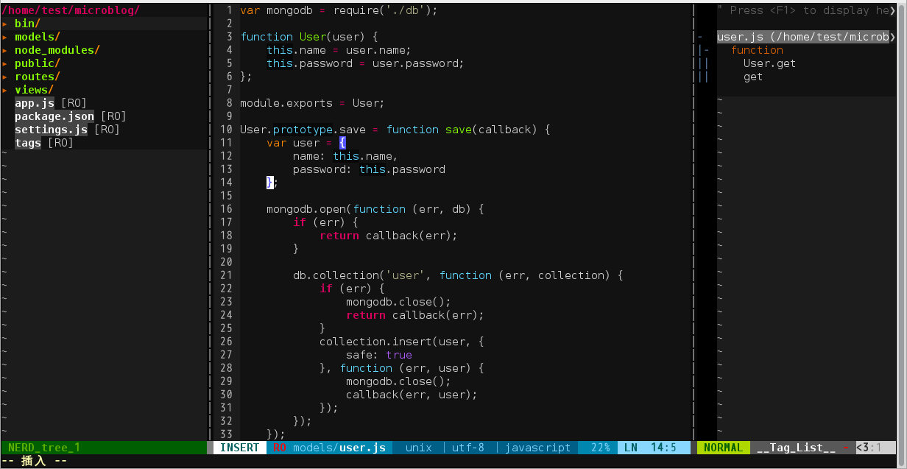

# /home/lgqlee/.vim/vimrc



My English is not well, I am sorry……

And this config is base on tlhunter's vimrc,I am sure his vimrc is beautiful and useful.

## Installation

Run these commands to get this Vim configuration working on your OS X or Linux machine:

This is tlhunter's vimrc, i am sure his is better.
```bash
cd ~
git clone git://github.com/tlhunter/vimrc.git .vim
ln -s ~/.vim/vimrc ~/.vimrc
```

This is mine,thanks again for tlhunter.
```bash
cd ~
git clone git://github.com/lgqlee/vimrc.git .vim
ln -s ~/.vim/vimrc ~/.vimrc
```

## Features

* Edit many files at the same time
* File Browser on left side of screen
* Functions, Variables, Classes on right
* Move between files in center screen
* View status of the current GIT repo, if applicable
* Additional features when running under MacVIM
* Quickly navigate to files using a fuzzy finder

### Switching between files (Buffers)

* Use _,q_ to close the current file (a different file will appear in its place)
* Use _Ctrl h Ctrl l_ to move between open files
 * _Ctrl Left Ctrl Right_ also works for switching between files
 * While in MacVIM, you can swipe left and right to switch between open files
* Use _Cmd Shift N_ (or _Alt n_ in Linux GVim) to open a new empty buffer

### Viewports (Windows/Splits)

* Use _,h ,j ,k ,l_ to navigate between viewports
* Use _,Q_ to close the current window (you probably won't ever need to do this)
* Use _,n_ to toggle the file browser
* Use _,y_ to toggle the tag browser
* Use _Ctrl+P_ to perform a recursive fuzzy filename search
* Use _,a_ and type a phrase to search to search based on content within your files (quote and escape if needed)
* Use _,A_ to close the open ack search results at the bottom of the screen

### File Browser (NERDTree)

* Use _,n_ to toggle the file browser
* Use standard movement keys to move around
* Use _Ctrl j_ and _Ctrl k_ to move between siblings (aka skip over children in expanded folders)
* Use _C_ to make the highlighted node the current working directory
* Use _:Bookmark BookmarkName_ to bookmark the current selection
* Use _B_ to toggle the bookmark menu
* Use _?_ if you'd like some NERDTree documentation
* Use _o_ to open the selected file in a new buffer
* Use _t_ to open the selected file in a new tab

### Tabs

* Use _Cmd t_ (or _Alt t_ in Linux GVim) to open a new tab
* Use _Cmd w_ (or _Alt w_ in Linux GVim) to close the current tab
* Use _Cmd 1_ to _Cmd 9_ (or _Alt 1_ to _Alt 9_ in Linux GVim) to navigate to the specified tab

### Taglist

* Use _F3_ to toggle taglist

### Themes (ColorSchemes)

There is a very large collection of colorschemes in this repository.
Many of them can be seen [here](http://vimcolors.com/).
Set the scheme using `:colorscheme NAME`.

#### Pre-Requisites

* Install ctags and [configure on your Mac](http://thomashunter.name/blog/installing-vim-taglist-with-macvim-in-os-x/).
* _NB: Tag List is currently not functioning_

### Copying and Pasting between OS

* Use _,c_ to copy the highlighted text into the OS clipboard
* Use _,v_ to paste the OS clipboard into the document
